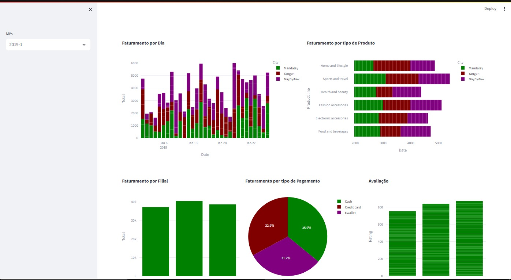

<h1 align="center">:file_cabinet:Dashboard</h1>

## :memo: Descrição
Criar um Dashboard com a linguagem Python que será utilizado para analisar dados em uma grande empresa de varejo ( empresa fictícia, assim como os dados presentes no arquivo excel.)

## :books: Funcionalidades
* <b>Funcionalidade </b>: Dashboard utilizado para analisar sobre: Faturamento por mês e unidade; Tipo de produto mais vendido; Desempenho das formas de pagamento e Avaliação média por filial 
*  

## :wrench: Tecnologias utilizadas
* Linguagem Python, juntamente com as bibliotecas StreamLit para a construção dos dashboards; Pandas para a manipulação de dados e Plotly para a construção dos gráficos

## :rocket: Rodando o projeto
Para rodar o repositório é necessário clonar o mesmo, dar o seguinte comando para iniciar o projeto:
```
git clone (https://github.com/armandomonteir-o/dashboard-python.git)
```

## :soon: Implementação futura
* Esse projeto tem como intuito simular uma situação que ocorre constantemente no mercado de trabalho, simplificando o acesso a dados e evitando a utilização do PowerBI

## :handshake: Colaboradores
<table>
  <tr>
    <td align="center">
      <a href="https://github.com/armandomonteir-o">
        <br>
        <sub>
          <b>Armando Monteiro</b>
        </sub>
      </a>
    </td>
  </tr>
</table>

## :dart: Status do projeto
* Concluido.
